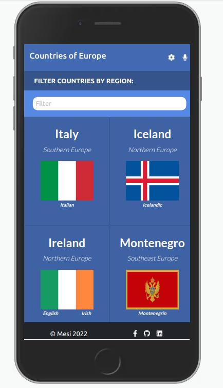
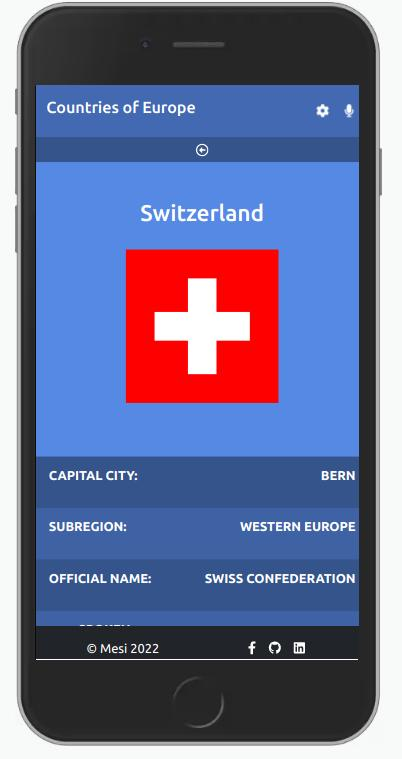

# Travel-Guide


> This website is meant to be a travel guide with informations about the european countries. The data is fetched from an external API.
> It is created with [Create-React-App](https://github.com/facebook/create-react-app)

---

## Screenshot

 | 

## Live version

For the live version of this project visit the following [Netlify](https://harmonious-elf-f99081.netlify.app) 

## Get started

```bash
   git clone git@github.com:Mesi21/Travel-Guide.git
   cd into the folder by typing: cd Travel-Guide
```

 :heavy_plus_sign: add your contribution if you'd like
 And please feel free to make a PR

 ## Technology

- React-Create-App
- React-DOM
- Redux
- npm
- Javascript ES6
- Nodejs
- HTML && CSS

## Authors

#### :bust_in_silhouette: Molnar Emese 
  - [Mesi21](https://github.com/Mesi21)
  - [LinkedIn](https://www.linkedin.com/in/emesemesimolnar/)  
  - [Twitter](https://twitter.com/buksimesi21) 

## 🤝 Contributing
All contributions, issues and feature requests are welcome!

1. Fork it (https://github.com/Mesi21/Travel-Guide.git)
2. Create your working branch (git checkout -b [choose-a-name])
3. Commit your changes (git commit -am 'what this commit will fix/add/improve')
4. Push to the branch (git push origin [chosen-name])
5. Create a new Pull Request

# Acknowledgments
- [Nelson Sakwa](https://www.behance.net/sakwadesignstudio) for a great design.
- [RestCountries API](https://restcountries.com/v3.1).
- [Microverse](https://www.microverse.org/).

# Show your support:

Give a :star: if you liked the app.

# License
- This project is [MIT](LICENSE.md) licensed.
- This project is also licensed under [Creative Commons](https://creativecommons.org/licenses/by-nc/4.0/).